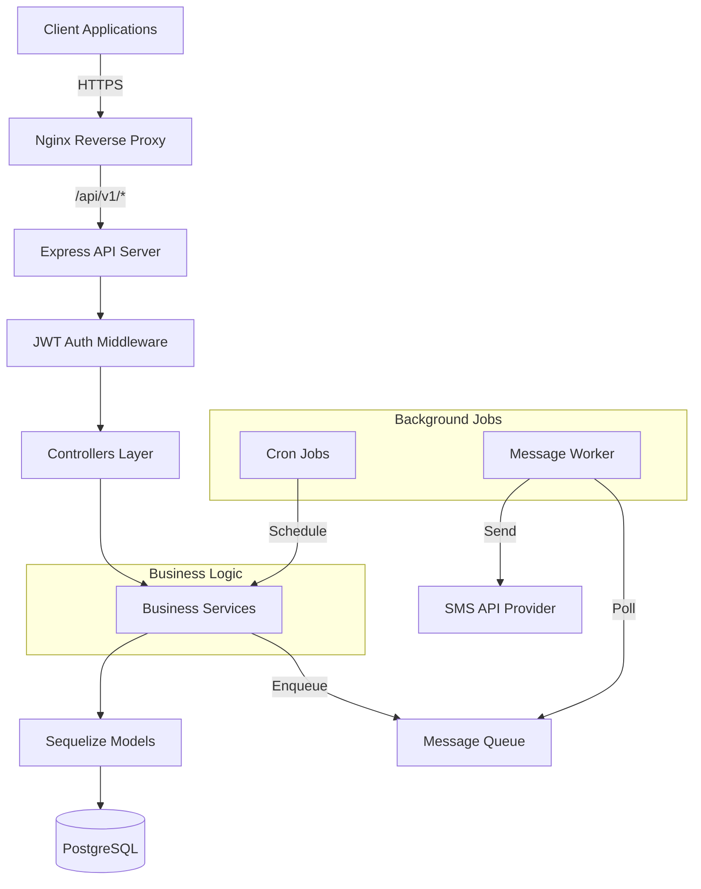
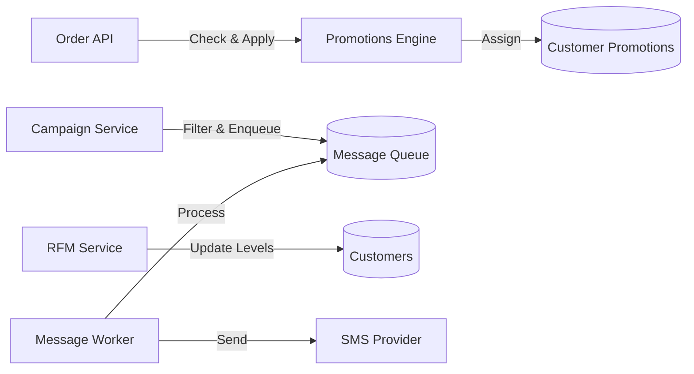

# CRM and Customer Loyalty Platform Backend - 3 Phase Implementation

## Overview

Building a complete backend system using **Node.js + Express + TypeScript + Sequelize + PostgreSQL** following the project conventions defined in `[agents.md](agents.md)`. The implementation will follow RESTful principles, use JWT authentication, and include Swagger documentation.

---

## Complete Database Schema (DBML)

### RBAC Tables Structure

```dbml
// =============================================
// ACCESS CONTROL TABLES (RBAC)
// =============================================

Table Roles {
  id integer [primary key, increment]
  role_name varchar(100) [unique, not null, note: "e.g., Sales Representative, Sales Manager, Administrator"]
  description text
  created_at timestamp [default: `CURRENT_TIMESTAMP`]
  updated_at timestamp [default: `CURRENT_TIMESTAMP`]
}

Table Permissions {
  id integer [primary key, increment]
  action_code varchar(100) [unique, not null, note: "e.g., customers:create, orders:delete, customers:read_own"]
  description text [note: "Human-readable description of the permission"]
  resource varchar(50) [note: "Resource category: customers, orders, tasks, etc."]
  created_at timestamp [default: `CURRENT_TIMESTAMP`]
}

Table RolePermissions {
  role_id integer [not null]
  permission_id integer [not null]
  created_at timestamp [default: `CURRENT_TIMESTAMP`]
  
  Indexes {
    (role_id, permission_id) [primary key]
  }
}

Table Users {
  id integer [primary key, increment]
  username varchar(100) [unique, not null]
  password_hash varchar(255) [not null]
  full_name varchar(150)
  email varchar(150) [unique]
  role_id integer [not null]
  is_active boolean [default: true]
  created_at timestamp [default: `CURRENT_TIMESTAMP`]
  updated_at timestamp [default: `CURRENT_TIMESTAMP`]
}

// Relationships
Ref: RolePermissions.role_id > Roles.id [delete: cascade]
Ref: RolePermissions.permission_id > Permissions.id [delete: cascade]
Ref: Users.role_id > Roles.id
```

All other tables (Customers, Orders, Products, etc.) remain as specified in original DBML with addition of RBAC relationships.

---

## Phase 1: Core Infrastructure & Database Foundation

### Goals

Establish the foundational backend structure, database models, authentication system, and basic CRUD operations.

### Key Deliverables

**1. Project Setup & Configuration**

- Initialize TypeScript Node.js project with proper folder structure (`src/controllers`, `src/models`, `src/routes`, `src/middlewares`, `src/utils`)
- Configure Sequelize with PostgreSQL connection
- Set up environment variables (.env.example)
- Configure ESLint, Prettier for code quality
- Install core dependencies: express, sequelize, pg, jsonwebtoken, bcrypt, yup, helmet, cors, swagger-jsdoc, swagger-ui-express

**2. Database Models Implementation**

Create all 18 Sequelize models based on the DBML schema:

- Core models: Users, Roles, Customers, CustomerLevels
- RBAC models: Permissions, RolePermissions (many-to-many pivot)
- Project management: Projects, Tasks, WorkLogs
- Commerce: Products, Orders, OrderItems, Transactions
- Marketing: Promotions, CustomerPromotions, Campaigns
- New model: MessageQueue (for campaign messages)

All models include:

- Proper TypeScript interfaces
- Field validations
- Associations/relationships as per DBML
- Timestamps (createdAt, updatedAt)

**3. Authentication & RBAC System**

- JWT-based authentication middleware
- Password hashing with bcrypt
- Auth routes: `/api/v1/auth/login`, `/api/v1/auth/register`
- **Granular Permission-Based Authorization Middleware**:
  - Check user's role and associated permissions from RolePermissions table
  - Middleware validates action codes (e.g., `customers:create`, `orders:delete`)
  - Return 403 Forbidden if user lacks required permission
  - Support for ownership checks (e.g., `customers:read_own` vs `customers:read_all`)
- Protected route examples with permission decorators

**4. Basic CRUD APIs**

Implement RESTful endpoints for core entities:

- **Customers API** (`/api/v1/customers`): Full CRUD with filtering, pagination, and search
  - Apply ownership filters based on user permissions (read_own vs read_all)
- **Products API** (`/api/v1/products`): Create, read, update, delete products
- **Users API** (`/api/v1/users`): User management (admin only)
  - GET /api/v1/users - List users
  - POST /api/v1/users - Create user with role assignment
  - PUT /api/v1/users/:id - Update user
  - DELETE /api/v1/users/:id - Delete user
- **Roles & Permissions API** (Admin only):
  - GET /api/v1/roles - List all roles with permission counts
  - GET /api/v1/roles/:id - Get role details with all permissions
  - POST /api/v1/roles - Create new role
  - PUT /api/v1/roles/:id - Update role name/description
  - DELETE /api/v1/roles/:id - Delete role (if no users assigned)
  - GET /api/v1/permissions - List all available permissions
  - POST /api/v1/roles/:id/permissions - Assign permissions to role
  - DELETE /api/v1/roles/:id/permissions/:permissionId - Remove permission from role

**5. Validation & Error Handling**

- Yup schemas for input validation
- Centralized error handling middleware
- Consistent error response format
- Input sanitization

**6. API Documentation**

- Swagger/OpenAPI setup at `/api-docs`
- Document all Phase 1 endpoints
- Request/response schemas
- Authentication requirements

**7. Database Migrations & Seeds**

- Sequelize migrations for all tables (18 total including RBAC tables)
- Seed data for RBAC system:
  - **3 Default Roles**:
    - Sales Representative (کارشناس فروش): Limited to own customers and tasks
    - Sales Manager (مدیر فروش): Team oversight, campaign management
    - Administrator (مدیر کل): Full system access
  - **Permissions Table**: All action codes (customers:create, customers:read_own, customers:read_all, customers:update_own, customers:update_all, customers:delete, orders:create, orders:read, orders:delete, tasks:create, tasks:read_own, tasks:read_all, tasks:assign, tasks:update_status_own, worklogs:create, worklogs:read_own, worklogs:read_all, campaigns:create, campaigns:execute, promotions:create, promotions:update, users:create, users:read, users:update, users:delete, roles:manage, settings:manage, reports:read_all, etc.)
  - **RolePermissions Mapping**: Assign appropriate permissions to each role
- Seed data for CustomerLevels (Bronze, Silver, Gold, Platinum) - configurable via admin panel
- Default admin user account

**8. Permission Seeder Example**

Sample permissions to be seeded:

```javascript
// Customer permissions
customers:create, customers:read_own, customers:read_all, 
customers:update_own, customers:update_all, customers:delete

// Order permissions
orders:create, orders:read, orders:update, orders:delete

// Task permissions
tasks:create, tasks:read_own, tasks:read_all, tasks:assign,
tasks:update_own, tasks:update_all, tasks:update_status_own, tasks:delete

// Work log permissions
worklogs:create, worklogs:read_own, worklogs:read_all, worklogs:update, worklogs:delete

// Project permissions
projects:create, projects:read_own, projects:read_all, projects:update, projects:delete

// Campaign permissions
campaigns:create, campaigns:read, campaigns:update, campaigns:execute, campaigns:delete

// Promotion permissions
promotions:create, promotions:read, promotions:update, promotions:delete

// User management permissions
users:create, users:read, users:update, users:delete

// Role management permissions
roles:manage, permissions:manage

// System permissions
settings:manage, reports:read_all, database:backup, logs:view
```

**9. Implementation Documentation**

Write all implementation documents to the `/backend/docs` folder including:

- RBAC permission matrix
- API endpoint documentation with required permissions
- Database schema diagram

### Detailed RBAC Permission Structure

**Role: Sales Representative (کارشناس فروش)**

- Purpose: Front-line staff handling daily customer interactions
- Permissions:
  - `customers:create` - Create new customers
  - `customers:read_own` - View only assigned customers
  - `customers:update_own` - Update only assigned customers
  - `worklogs:create` - Log their own activities
  - `worklogs:read_own` - View their own work logs
  - `tasks:read_own` - View assigned tasks
  - `tasks:update_status_own` - Update status of their own tasks
  - `orders:create` - Create orders for customers
  - `projects:read_own` - View projects for assigned customers
- Restrictions: Cannot view other users' data, cannot delete anything, no access to settings/campaigns

**Role: Sales Manager (مدیر فروش)**

- Purpose: Team supervision, campaign management, reporting
- Permissions: All Sales Rep permissions PLUS:
  - `customers:read_all` - View all customers
  - `customers:update_all` - Update any customer
  - `customers:delete` - Delete customers
  - `worklogs:read_all` - View all team work logs
  - `tasks:create` - Create new tasks
  - `tasks:assign` - Assign tasks to team members
  - `tasks:read_all` - View all tasks
  - `campaigns:create` - Create SMS campaigns
  - `campaigns:execute` - Execute campaigns
  - `promotions:create` - Define promotion rules
  - `promotions:update` - Update promotions
  - `reports:read_all` - Access analytics and dashboards
- Restrictions: Cannot manage users or system settings

**Role: Administrator (مدیر کل)**

- Purpose: Full system management
- Permissions: All Sales Manager permissions PLUS:
  - `users:create` - Create new users
  - `users:read` - View all users
  - `users:update` - Update users
  - `users:delete` - Delete users
  - `roles:manage` - Manage roles and permissions
  - `settings:manage` - Access system settings
  - `database:backup` - Database operations
  - `logs:view` - View system logs

**Middleware Implementation Strategy**

Create `src/middlewares/rbac.middleware.ts`:

```typescript
export const requirePermission = (actionCode: string) => {
  return async (req, res, next) => {
    // 1. Get user from JWT token (already authenticated)
    // 2. Query RolePermissions to check if user's role has actionCode
    // 3. For _own permissions, add req.userId to query filters
    // 4. If authorized: next()
    // 5. If not: return 403 Forbidden
  }
}

// Usage in routes:
router.delete('/customers/:id', 
  authenticate, 
  requirePermission('customers:delete'), 
  customerController.delete
);
```

---

## Phase 2: Business Logic & Advanced Features

### Goals

Implement order management, promotion system, campaign functionality, and core business logic.

### Key Deliverables

**1. Order Management System**

- **Quick Order Creation** (`POST /api/v1/orders`):
- Accept customer_id and order_items array
- Calculate total_amount, tax_amount
- Check and apply available promotions from CustomerPromotions
- Mark promotions as used
- Create order and order items in transaction
- Return complete order with applied discounts
- **Order History** (`GET /api/v1/orders`): List orders with filtering
- **Order Details** (`GET /api/v1/orders/:id`): Get order with items

**2. Transaction Management**

- **Create Transaction** (`POST /api/v1/transactions`): Record payments (CASH/CHECK)
- **Customer Transactions** (`GET /api/v1/customers/:id/transactions`): Payment history

**3. Promotions Engine Service**

Create a modular promotions engine (`src/services/promotionsEngine.ts`):

- Parse condition_json rules:
- `{"type": "first_purchase"}` - Check if customer has no prior orders
- `{"type": "customer_level", "level_id": 2}` - Match customer level
- `{"type": "referral"}` - Check if customer was referred
- `{"type": "minimum_purchase", "amount": 1000}` - Order total threshold
- Evaluate promotion eligibility for a customer
- Auto-assign promotions when conditions are met
- Calculate expiry_date based on duration_days
- **Promotion APIs** (`/api/v1/promotions`): CRUD operations (admin only)

**4. Campaign Management**

- **Campaign CRUD** (`/api/v1/campaigns`): Create, list, update campaigns (admin only)
- **Campaign Execution Service** (`src/services/campaignService.ts`):
- Parse filter_conditions_json (e.g., `{"level": "Gold", "last_purchase_days_ago": ">90"}`)
- Query customers matching filters
- Render message_template with placeholders ([FirstName], [LastName], [Level])
- Populate MessageQueue table with messages
- **Execute Campaign** (`POST /api/v1/campaigns/:id/execute`): Trigger campaign manually

**5. Project & Task Management**

- **Projects API** (`/api/v1/projects`): CRUD for customer projects
- **Tasks API** (`/api/v1/tasks`): Create, assign, and update tasks
- **My Tasks** (`GET /api/v1/tasks/my-tasks`): Get authenticated user's tasks
- **Update Task Status** (`PUT /api/v1/tasks/:id/status`): Mark tasks as completed

**6. Work Log System**

- **Create Work Log** (`POST /api/v1/worklogs`): Log activities for customers/tasks
- **Customer Work Logs** (`GET /api/v1/customers/:id/worklogs`): View customer interaction history

**7. Enhanced Swagger Documentation**

- Document all Phase 2 endpoints
- Add promotion condition examples
- Campaign filter examples
- Order creation flow documentation

---

## Phase 3: Automation & Background Services

### Goals

Implement automated RFM scoring, recurring tasks, automated messaging, and background job processing.

### Key Deliverables

**1. RFM Score Calculation Service**

Create schedulable service (`src/services/rfmService.ts`):

- Daily cron job (using node-cron)
- For each customer, calculate:
- **Recency (R)**: Days since last order (lower is better)
- **Frequency (F)**: Total order count
- **Monetary (M)**: Sum of final_amount
- Score each metric 1-5 based on configurable thresholds (stored in config or database)
- Calculate weighted average score
- Update customer_level_id in Customers table
- Log scoring results for auditing

**2. Automated Message System**

Implement background messaging infrastructure:

- **MessageQueue Model**: Add fields (id, customer_id, phone_number, message_text, status, scheduled_for, sent_at, error_message)
- **Message Queue Worker** (`src/workers/messageQueueWorker.ts`):
- Continuous polling service
- Fetch pending messages from MessageQueue
- Integrate SMS API (generic/mock implementation with interface for easy provider swap)
- Update message status (SENT/FAILED)
- Retry logic for failed messages
- **Automated Message Triggers**:
- Birthday messages (check Customers.birth_date daily)
- Inactivity notifications (customers with no orders in X days)
- Welcome messages for new customers

**3. Recurring Tasks Service**

Create automated task management (`src/services/recurringTasksService.ts`):

- Cron job to check tasks where is_recurring=true
- Compare current date with last_triggered_at and recurring_interval_days
- Duplicate tasks when interval has passed
- Update last_triggered_at timestamp

**4. Event-Driven Promotion Assignment**

Implement event hooks that trigger promotion evaluation:

- After order creation: Check "first_purchase" and "minimum_purchase" promotions
- After customer referral: Check "referral" promotions
- After level change: Check "customer_level" promotions
- Integrate with promotionsEngine service

**5. Background Job Management**

- Set up node-cron for scheduled tasks
- Create job configuration and scheduling system
- Implement job logging and monitoring
- Error handling and alerting for failed jobs

**6. Reporting & Analytics Endpoints (Optional Enhancement)**

- **Dashboard Stats** (`GET /api/v1/dashboard/stats`): Key metrics
- **Customer Analytics** (`GET /api/v1/analytics/customers`): Level distribution, growth
- **Sales Reports** (`GET /api/v1/analytics/sales`): Revenue trends

**7. Docker & Deployment Configuration**

- Create backend Dockerfile (multi-stage build)
- Update docker-compose.yml with:
- Backend service
- PostgreSQL service
- Redis service (for job queuing)
- Nginx configuration (reverse proxy)
- Environment-specific configurations
- Database migration scripts in container startup

**8. Testing & Documentation**

- Unit tests for business logic services (RFM, promotions, campaigns)
- Integration tests for critical APIs
- Complete Swagger documentation
- README with setup instructions
- API usage examples

---

## Technical Architecture




---

## Key Services Architecture




---

## Implementation Decisions (Finalized)

1. **RFM Scoring Thresholds**: Configurable via environment variables with database storage option for future admin panel management
2. **SMS Provider**: Mock implementation with abstract interface for easy provider integration (Kavenegar/Twilio)
3. **MessageQueue Worker**: Runs as part of main app process with capability to run separately
4. **Database Seed Data**: CustomerLevels seeded with defaults, fully manageable via admin panel after deployment
5. **Campaign Filters**: Support for level and last_purchase_days_ago (extensible architecture for future filters)
6. **RBAC Authorization**: Three-tier permission system implemented:
  - **Sales Representative**: Limited to own customers/tasks (customers:read_own, tasks:read_own)
  - **Sales Manager**: Full team oversight + campaigns (customers:read_all, campaigns:create)
  - **Administrator**: Complete system access (users:manage, roles:manage, settings:manage)
  - Granular permissions stored in Permissions table with action codes (e.g., customers:create, orders:delete)
  - RolePermissions pivot table for flexible permission assignment

