# Frontend Architecture — Customer Loyalty Module

Design for the React frontend of the Lightweight Customer Loyalty Module (Customer Club), aligned with the backend API contract, database schema, and business requirements. No code yet; this document defines pages, routes, components, admin workflows, and data flow.

---

## 1. Tech Stack (from AGENTS.md)

- **React 18** + **TypeScript** + **Vite**
- **Zustand** for global state
- **Axios** for API (services layer)
- **Yup** for form validation
- **TailwindCSS** + **shadcn/ui** for UI
- **React Router** for routing

---

## 2. Pages and Routes

### 2.1 Route Structure

All app routes live under a single router. Auth-gated routes use a layout that checks token and redirects to login when missing.

| Path | Purpose | Auth | Role focus |
|------|---------|------|------------|
| `/login` | Login form | No | All |
| `/` | Dashboard / home after login | Yes | All |
| `/customers` | Customer list (search, filter) | Yes | Sales / Admin |
| `/customers/new` | Minimal customer registration | Yes | Sales / Admin |
| `/customers/:id` | Customer detail (profile, level, RFM, orders, transactions, work logs) | Yes | Sales / Admin |
| `/customers/:id/edit` | Edit customer | Yes | Sales / Admin |
| `/orders/new` | Fast order registration (admin) | Yes | Sales / Admin |
| `/orders` | Order list | Yes | Sales / Admin |
| `/orders/:id` | Order detail | Yes | Sales / Admin |
| `/products` | Product list | Yes | Sales / Admin |
| `/products/new` | Create product | Yes | Admin |
| `/products/:id/edit` | Edit product | Yes | Admin |
| `/promotions` | Promotion list | Yes | Manager / Admin |
| `/promotions/new` | Create promotion | Yes | Manager / Admin |
| `/promotions/:id` | Promotion detail + assign to customer | Yes | Manager / Admin |
| `/promotions/:id/edit` | Edit promotion | Yes | Manager / Admin |
| `/campaigns` | Campaign list | Yes | Manager / Admin |
| `/campaigns/new` | Create campaign | Yes | Manager / Admin |
| `/campaigns/:id` | Campaign detail + execute | Yes | Manager / Admin |
| `/campaigns/:id/edit` | Edit campaign | Yes | Manager / Admin |
| `/settings/levels` | Loyalty levels (RFM) config (list + edit) | Yes | Admin |
| `/transactions` | Transaction list (optional filter by customer) | Yes | Sales / Admin |
| `/users` | User list (admin) | Yes | Admin |
| `/users/new` | Create user | Yes | Admin |
| `/roles` | Roles and permissions | Yes | Admin |
| `/404` | Not found | Yes | All |

**Optional (CRM extras):** `/projects`, `/tasks`, `/worklogs` can be added later; not required for the minimal loyalty scope.

### 2.2 Route Hierarchy

```
/                    → DashboardLayout → DashboardPage
/login               → LoginPage (no layout)
/customers           → AppLayout → CustomerListPage
/customers/new       → AppLayout → CustomerRegistrationPage
/customers/:id       → AppLayout → CustomerDetailPage
/customers/:id/edit  → AppLayout → CustomerEditPage
/orders/new          → AppLayout → OrderCreatePage
/orders              → AppLayout → OrderListPage
/orders/:id          → AppLayout → OrderDetailPage
/products            → AppLayout → ProductListPage
...
/settings/levels     → AppLayout → CustomerLevelsSettingsPage
```

- **AppLayout:** Sidebar/nav, header (user menu, logout), outlet for child routes.
- **DashboardLayout:** Same as AppLayout or a slimmer variant; dashboard is the default landing after login.

### 2.3 Permission-Aware Routes

- Routes are wrapped with a permission check (e.g. `customers:read_all` or `customers:read_own` for customer pages). If the user lacks permission, show a “Forbidden” view or redirect.
- Nav items are rendered based on the same permissions so users only see links they can access.

---

## 3. Main Components

### 3.1 Layout Components

| Component | Responsibility |
|-----------|----------------|
| **AppLayout** | Main shell: sidebar, top bar, main content area (outlet). Uses auth store to show user and logout. |
| **Sidebar** | Navigation links (Dashboard, Customers, Orders, Products, Promotions, Campaigns, Settings, Users/Roles if admin). Collapsible on small screens. |
| **Header** | App title, user avatar/name, logout. |
| **MainContent** | Wraps outlet with consistent padding and max-width. |

### 3.2 Shared / Reusable Components

| Component | Responsibility |
|-----------|----------------|
| **DataTable** | Generic table: columns config, sort, pagination (page/limit), loading and empty states. Used for customers, orders, products, promotions, campaigns, transactions, users. |
| **SearchInput** | Debounced search; used in customer search (last 4 digits, partial name) and list filters. |
| **Pagination** | Page/limit/total from API; onPageChange callback. |
| **Card** | shadcn Card for grouping content (e.g. customer summary, RFM panel, order summary). |
| **Badge** | Status badges: customer status (LEAD/OPPORTUNITY/CUSTOMER), order status, campaign status (DRAFT/SCHEDULED/SENT), level name (Gold/Silver/Bronze). |
| **Button**, **Input**, **Select**, **Label** | shadcn primitives; used in all forms. |
| **FormField** | Label + input + error message; used with Yup validation. |
| **Modal / Dialog** | Confirm delete, assign promotion to customer, execute campaign. |
| **Toast** | Success/error feedback after API calls (e.g. “Customer created”, “Order created”, “Campaign queued”). |
| **LoadingSpinner** | Full-page or inline loading. |
| **EmptyState** | “No customers yet”, “No orders”, etc. |

### 3.3 Feature Components (by domain)

**Auth**

- **LoginForm** — username, password; submit → POST `/auth/login`; store token and user; redirect to `/`.

**Customers**

- **CustomerListPage** — SearchInput (maps to `GET /customers?search=&status=&page=&limit=`), DataTable (columns: name, phone, status, level, actions). Row click or “View” → `/customers/:id`.
- **CustomerRegistrationForm** — Minimal: phone (required), full name (first + last or single field), date of birth. Submit → POST `/customers`. Optional: “Referred by” (search/select customer → `referredByCustomerId`). Redirect to `/customers/:id` or list.
- **CustomerDetailPage** — Tabs or sections: Profile (GET `/customers/:id`), RFM (GET `/customers/:id/rfm`), Orders (from orders list filtered by customer or link to orders?customerId=), Transactions (GET `/customers/:id/transactions`), Work logs (GET `/customers/:id/worklogs`). Edit button → `/customers/:id/edit`.
- **CustomerProfileCard** — Displays customer fields + customerLevel (from API). Used in detail and possibly in order flow when customer is selected.
- **CustomerRFMCard** — Displays recency, frequency, monetary, averageScore, level; uses GET `/customers/:id/rfm`.
- **CustomerEditForm** — Pre-filled from GET `/customers/:id`; PUT `/customers/:id` on submit.

**Orders**

- **OrderCreatePage** — Core admin workflow (see Section 4.2). Steps: (1) Search/select customer, (2) Add line items (product + quantity), (3) Optional: select promotion (customer’s active promotions), (4) Review totals (backend formula: totalAmount − discount + tax), (5) Submit POST `/orders` with `customerId`, `orderItems`, `discountAmount`, `taxAmount`, `customerPromotionId` (if selected).
- **OrderForm** — Customer selector (search → pick), product line items (product select, quantity), optional promotion select, optional manual discount/tax, live total display. Submit → POST `/orders`.
- **OrderListPage** — DataTable: order id, date, customer, final amount, status; filters optional. GET `/orders`. Link to `/orders/:id`.
- **OrderDetailPage** — GET `/orders/:id`; show order header, customer, line items, totals, discount, tax.

**Products**

- **ProductListPage** — DataTable: name, price, tax rate; GET `/products`. Create → `/products/new`.
- **ProductForm** — Create/Edit: productName, price, taxRate. POST `/products` or PUT `/products/:id`.

**Promotions**

- **PromotionListPage** — DataTable: title, reward type/value, condition type, active, validity; GET `/promotions`. Create → `/promotions/new`.
- **PromotionForm** — Title, rewardType (PERCENTAGE / FIXED_AMOUNT), rewardValue, conditionJson (e.g. type: first_purchase | minimum_purchase | customer_level | referral | referral_referrer, and amount/level_id as needed), durationDays, isActive. POST or PUT.
- **PromotionDetailPage** — GET `/promotions/:id`; “Assign to customer” → modal with customer search, POST `/promotions/:id/assign` with customerId.
- **AssignPromotionModal** — Customer search/select; submit POST `/promotions/:id/assign`.

**Campaigns**

- **CampaignListPage** — DataTable: name, status, scheduledSendTime, createdBy; GET `/campaigns`. Create → `/campaigns/new`.
- **CampaignForm** — Name, messageTemplate, filterConditionsJson (e.g. level, status, last_purchase_days_ago), scheduledSendTime, status. POST or PUT.
- **CampaignDetailPage** — GET `/campaigns/:id`; “Execute” button → confirm → POST `/campaigns/:id/execute`; show messageCount in toast or inline.

**Settings**

- **CustomerLevelsSettingsPage** — GET `/customer-levels`; list levels (name, minScore, maxScore). Edit inline or modal → PUT `/customer-levels/:id`. Admin only (roles:manage).

**Users & Roles (Admin)**

- **UserListPage** — GET `/users`; DataTable; create/edit user (POST/PUT `/users`), delete (DELETE `/users/:id`).
- **RoleListPage** — GET `/roles`; GET `/roles/permissions`; assign permissions to role (POST `/roles/:id/permissions`).

**Transactions**

- **TransactionListPage** — GET `/transactions` with optional customerId, page, limit; DataTable. Link to customer when applicable.

---

## 4. Admin Workflows

### 4.1 Customer Registration (Minimal)

**Goal:** Fast, minimal data: mobile (unique), full name, date of birth.

**Flow:**

1. Admin opens **Customer list** → “Add customer” → **Customer registration** page (`/customers/new`).
2. Form: **Phone** (required), **Full name** (first + last or one field mapped to firstName + lastName), **Date of birth** (optional). Optional: “Referred by” (search customer, set `referredByCustomerId`).
3. Submit → POST `/api/v1/customers` with `{ lastName, phoneNumber, firstName?, birthDate?, referredByCustomerId? }`.
4. On success: toast “Customer created”; redirect to `/customers/:id` (detail) or `/customers`.
5. On error (e.g. phone exists): show validation message.

**Data flow:** Form state (local or controlled) → validation (Yup) → auth API service (Axios) → backend → on success update customers list store (optional) and navigate.

### 4.2 Order Creation (Fast)

**Goal:** Search customer (last 4 digits or partial name), select products and quantities, optional coupon; system calculates final price.

**Flow:**

1. Admin opens **Create order** (`/orders/new`).
2. **Step 1 — Customer:** Search input → GET `/customers?search=<term>&limit=20`. Select one customer; store `customerId` and show customer summary (name, phone, level).
3. **Step 2 — Line items:**  
   - Product selector (GET `/products`); quantity input.  
   - Add multiple rows.  
   - Subtotal computed client-side from product list (price × quantity) for UX; final totals come from backend on submit.
4. **Step 3 — Discount (optional):**  
   - If backend supports GET “customer’s active promotions”: call a dedicated endpoint or derive from customer detail; show list of applicable promotions.  
   - User selects one → frontend sends `customerPromotionId` in POST body; backend applies discount and marks used.  
   - Or: manual discount/tax fields only (discountAmount, taxAmount) if no promotion API for list.
5. **Step 4 — Review:** Show customer, line items, subtotal, discount, tax, **final amount** (can be approximated client-side; backend is source of truth).
6. Submit → POST `/api/v1/orders` with `{ customerId, orderItems: [{ productId, quantity }], discountAmount?, taxAmount?, customerPromotionId? }`.
7. On success: toast “Order created”; redirect to `/orders/:id` or `/orders`.
8. On error (e.g. invalid promotion): show message.

**Data flow:** Page state (customerId, orderItems[], selectedCustomerPromotionId?, discountAmount, taxAmount) → validation → order API service → backend → optional: invalidate orders list cache / refetch.

### 4.3 Campaigns (Create and Execute)

**Goal:** Create bulk SMS campaign (e.g. “Yalda Campaign”); optionally schedule; execute to queue messages.

**Flow:**

1. **Create:** Admin/Manager → **Campaigns** → “New campaign” → **Campaign form**.  
   - Name, message template (e.g. with placeholders [FirstName], [Level]).  
   - Filter conditions (JSON or form): level, status, last_purchase_days_ago (from backend contract).  
   - Optional: scheduled send time, status (DRAFT/SCHEDULED).  
   - Submit → POST `/api/v1/campaigns`.
2. **List:** Campaign list shows status (DRAFT, SCHEDULED, SENT, CANCELLED); link to detail.
3. **Detail:** GET `/campaigns/:id`. Show name, template, filters, status, scheduled time.
4. **Execute:** “Execute” button → confirm dialog (“Queue SMS for all matching customers”) → POST `/api/v1/campaigns/:id/execute`.  
   - Response: `messageCount`.  
   - Toast: “Campaign executed; N messages queued.”
5. **Edit:** From detail → Edit → PUT `/campaigns/:id` (name, template, filters, schedule, status).

**Data flow:** Campaign form state → POST/PUT via campaign service → backend; execute → POST execute → show messageCount; campaign list store can be refetched or updated optimistically.

---

## 5. Data Flow Between Components

### 5.1 High-Level Data Flow

```
┌─────────────────────────────────────────────────────────────────────────┐
│                          React App                                       │
│  ┌─────────────┐    ┌──────────────┐    ┌─────────────────────────────┐ │
│  │   Pages /   │───▶│   Zustand    │───▶│   API Services (Axios)     │ │
│  │   Routes   │    │   Stores     │    │   (auth, customers, orders, │ │
│  │             │◀───│              │◀───│    products, promotions,    │ │
│  │             │    │              │    │    campaigns, levels, etc.) │ │
│  └─────────────┘    └──────────────┘    └─────────────────────────────┘ │
│         │                    │                           │               │
│         ▼                    ▼                           ▼               │
│  ┌─────────────┐    ┌──────────────┐            ┌─────────────────────┐│
│  │  Components │    │  Selectors   │            │  Backend /api/v1     ││
│  │  (UI)       │    │  (derived     │            │  (Express)           ││
│  │             │    │   state)     │            └─────────────────────┘│
│  └─────────────┘    └──────────────┘                                     │
└─────────────────────────────────────────────────────────────────────────┘
```

- **Pages** dispatch actions (e.g. “load customers”, “create order”) that call **API services** and then update **Zustand stores** (or use React Query–style cache in a single store).
- **Components** read from stores (or from page-level state that was populated by store/API). User actions in components trigger store actions or direct API calls that eventually update stores.
- **API layer** is the only place that talks to the backend; it uses Axios, base URL, and attaches the JWT from the auth store.

### 5.2 Auth Flow

1. **Login:** LoginForm → POST `/auth/login` → store receives `{ token, user }` → save token (memory + optional localStorage), set user in auth store → redirect to `/`.
2. **Protected routes:** Layout or route guard reads auth store; if no token, redirect to `/login`.
3. **API calls:** Axios interceptor adds `Authorization: Bearer <token>` from auth store.
4. **Logout:** Clear token and user from store (and storage); redirect to `/login`.
5. **Current user:** GET `/auth/me` on app init (if token exists) to refresh user and permissions.

### 5.3 Store Slices (Zustand)

Suggested slices (can be one store with slices or separate stores):

| Store | State | Actions | Used by |
|-------|--------|--------|---------|
| **authStore** | token, user (id, username, roleId, permissions or role), isAuthenticated | login, logout, setUser, fetchMe | Layout, login page, API interceptor |
| **customerStore** | list (paginated), currentCustomer, searchQuery, filters | fetchCustomers, fetchCustomerById, setSearch, createCustomer, updateCustomer | Customer list, detail, registration, order flow (customer picker) |
| **orderStore** | list, currentOrder | fetchOrders, fetchOrderById, createOrder | Order list, detail, order create page |
| **productStore** | list | fetchProducts | Order create (line items), product list |
| **promotionStore** | list, currentPromotion | fetchPromotions, fetchPromotionById, assignToCustomer | Promotion list, detail, order create (promotion picker if API exists) |
| **campaignStore** | list, currentCampaign | fetchCampaigns, fetchCampaignById, executeCampaign | Campaign list, detail |
| **customerLevelStore** | levels | fetchLevels, updateLevel | Settings/levels page |
| **uiStore** | sidebarOpen, toasts | setSidebarOpen, addToast, removeToast | Layout, global toasts |

- List endpoints often return pagination (page, limit, total); stores can hold `items`, `pagination`, `loading`, `error`.
- “Current” entity (e.g. currentCustomer, currentOrder) is used by detail and edit pages; can be set by fetchById or by navigation params (fetch by id when route matches).

### 5.4 API Services Layer

One service module per domain (or per resource) that mirrors the backend contract:

- **authService:** login(body), register(body), getMe().
- **customerService:** getCustomers(params), getById(id), create(body), update(id, body), delete(id), getWorklogs(id), getTransactions(id), getRfm(id).
- **orderService:** getOrders(), getById(id), create(body).
- **productService:** getProducts(), getById(id), create(body), update(id, body), delete(id).
- **promotionService:** getPromotions(), getById(id), create(body), update(id, body), delete(id), assign(id, customerId).
- **campaignService:** getCampaigns(), getById(id), create(body), update(id, body), execute(id).
- **customerLevelService:** getLevels(), getById(id), update(id, body).
- **transactionService:** getTransactions(params), getById(id), create(body).
- **userService**, **roleService:** for admin.

Each function returns the API response (e.g. `data.order`); the store or page handles loading/error and mapping to state.

### 5.5 Form and Validation Flow

- **Forms:** Local state (useState) or form library; on submit, validate with Yup schema (aligned with backend validation), then call service → then store action or direct navigation.
- **Errors:** Backend returns `{ success: false, error: { message, statusCode } }`; display message near form or in toast.
- **Success:** Toast + redirect or refetch list/detail.

### 5.6 Permission-Driven UI

- **Auth store** holds user and role; optionally a list of permissions (from GET `/auth/me` or derived from role).
- **Nav:** Sidebar only renders links for which the user has permission (e.g. `customers:read_all` or `customers:read_own` for Customers).
- **Routes:** Guard wraps routes that need a specific permission; redirects to 403 or dashboard if missing.
- **Buttons:** “Delete”, “Execute campaign”, “Assign promotion” etc. shown only when the user has the corresponding permission.

---

## 6. Summary Diagram

```mermaid
flowchart TB
  subgraph pages[Pages]
    Login[LoginPage]
    Dashboard[DashboardPage]
    CustomerList[CustomerListPage]
    CustomerNew[CustomerRegistrationPage]
    CustomerDetail[CustomerDetailPage]
    OrderNew[OrderCreatePage]
    OrderList[OrderListPage]
    PromotionList[PromotionListPage]
    CampaignList[CampaignListPage]
    CampaignDetail[CampaignDetailPage]
    LevelsSettings[CustomerLevelsSettingsPage]
  end

  subgraph layout[Layout]
    AppLayout[AppLayout]
    Sidebar[Sidebar]
    Header[Header]
  end

  subgraph shared[Shared Components]
    DataTable[DataTable]
    SearchInput[SearchInput]
    Pagination[Pagination]
    FormField[FormField]
    Modal[Modal]
    Toast[Toast]
  end

  subgraph stores[Zustand Stores]
    AuthStore[authStore]
    CustomerStore[customerStore]
    OrderStore[orderStore]
    ProductStore[productStore]
    PromotionStore[promotionStore]
    CampaignStore[campaignStore]
    LevelStore[customerLevelStore]
  end

  subgraph services[API Services]
    AuthAPI[authService]
    CustomerAPI[customerService]
    OrderAPI[orderService]
    ProductAPI[productService]
    PromotionAPI[promotionService]
    CampaignAPI[campaignService]
    LevelAPI[customerLevelService]
  end

  Login --> AuthAPI
  CustomerList --> CustomerStore
  CustomerNew --> CustomerStore
  CustomerDetail --> CustomerStore
  OrderNew --> OrderStore
  OrderNew --> ProductStore
  OrderNew --> CustomerStore
  OrderList --> OrderStore
  PromotionList --> PromotionStore
  CampaignList --> CampaignStore
  CampaignDetail --> CampaignStore
  LevelsSettings --> LevelStore

  CustomerStore --> CustomerAPI
  OrderStore --> OrderAPI
  ProductStore --> ProductAPI
  PromotionStore --> PromotionAPI
  CampaignStore --> CampaignAPI
  LevelStore --> LevelAPI
  AuthStore --> AuthAPI

  AppLayout --> Sidebar
  AppLayout --> Header
  CustomerList --> DataTable
  CustomerList --> SearchInput
  OrderNew --> FormField
  CampaignDetail --> Modal
```



---

This architecture document is the single reference for implementing the frontend: pages and routes, main components, admin workflows (customer registration, order creation, campaigns), and data flow between components and the backend API.
